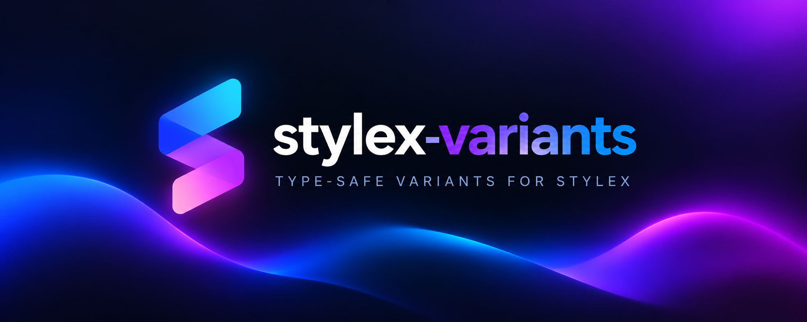

# StyleX Variants

[](https://www.npmjs.com/package/@stylex-variants/core)
[](https://www.npmjs.com/package/@stylex-variants/core)
[](https://github.com/corvallo/stylex-variants/actions/workflows/ci.yml)
[](https://github.com/corvallo/stylex-variants/actions/workflows/docs.yml)
[](https://github.com/corvallo/stylex-variants/actions/workflows/release.yml)
[](./LICENSE)



Typed, compile-time variants for [StyleX](https://stylexjs.com/), inspired by
[Tailwind Variants](https://www.tailwind-variants.org/).

StyleX Variants turns a static recipe into a type-safe function that returns
StyleX props. It supports named variants, boolean variants, defaults, compound
variants, recipe extension, multi-slot components, compound slot conditions,
and call-site overrides.

## Documentation and playground

- **[Read the documentation](https://corvallo.github.io/stylex-variants/)** for installation, configuration, API details, and supported patterns.
- **Run the playground locally**:

  ```sh
  pnpm install
  pnpm --filter playground dev
  ```

  The playground contains examples for variants, boolean and compound variants,
  `extend`, `className`/`style` overrides, `slots`, and `compoundSlots`.

## Installation

```sh
npm install @stylex-variants/core @stylexjs/stylex
npm install -D @babel/core@^8 @rolldown/plugin-babel @stylexjs/unplugin
```

The package is ESM-only. The Babel plugin must run before the StyleX compiler.
For Vite:

```ts
import babel from "@rolldown/plugin-babel";
import stylex from "@stylexjs/unplugin/vite";
import variants from "@stylex-variants/core/babel";
import react from "@vitejs/plugin-react";
import { defineConfig } from "vite";

export default defineConfig({
  plugins: [react(), babel({ plugins: [variants] }), stylex({ useCSSLayers: true })],
});
```

Import a CSS asset from the application entry point so Vite has an asset where
StyleX can emit its generated rules:

```ts
import "./index.css";
```

## Recipes

```tsx
import { sxv, type VariantProps } from "@stylex-variants/core";

const button = sxv({
  base: { display: "inline-flex", borderRadius: 8 },
  variants: {
    tone: {
      primary: { backgroundColor: "blue" },
      neutral: { backgroundColor: "gray" },
    },
    size: { sm: { padding: 8 }, lg: { padding: 16 } },
    fullWidth: { true: { width: "100%" }, false: { width: "auto" } },
  },
  defaultVariants: { tone: "primary", size: "sm", fullWidth: false },
  compoundVariants: [{ tone: "primary", size: "lg", style: { fontWeight: 700 } }],
});

type ButtonVariants = VariantProps<typeof button>;

export function Button(props: ButtonVariants) {
  return <button {...button(props)}>Continue</button>;
}
```

Omitted props use `defaultVariants`. An explicit `false` is preserved for
boolean variants. `className` is concatenated with generated classes and
`style` is merged with generated StyleX props.

## Extending a recipe

`sxv.extend` composes a statically declared recipe and keeps its variant map:

```ts
const iconButton = sxv.extend(button, {
  base: { width: 40, height: 40, padding: 0 },
  variants: {
    size: { sm: { width: 32, height: 32 }, lg: { width: 48, height: 48 } },
  },
  defaultVariants: { size: "sm" },
});
```

The base recipe and extension must be declared in the same module so the Babel
plugin can inspect both static configurations. See the
[extend guide](https://corvallo.github.io/stylex-variants/docs/extend).

## Slots and compound slots

Use `slots` when a component has multiple independently styled elements:

```ts
const card = sxv({
  slots: {
    root: { display: "flex", flexDirection: "column" },
    title: { fontSize: 18, fontWeight: 700 },
  },
  variants: {
    tone: {
      neutral: { root: { backgroundColor: "white" } },
      accent: { root: { backgroundColor: "lightblue" } },
    },
  },
  compoundSlots: [
    { tone: "accent", slots: { root: { borderWidth: 2 } } },
  ],
});

const styles = card({ tone: "accent" });
return <article {...styles.root()}><h2 {...styles.title()}>Title</h2></article>;
```

Each slot accepts the same `className` and `style` overrides as a regular
recipe. See the [slots guide](https://corvallo.github.io/stylex-variants/docs/slots).

## Supported constraints

- Recipe configuration must use static inline literals.
- Spreads, computed keys, external style objects, and dynamic style functions
  are rejected by the compiler.
- `sxv()` and `sxv.extend()` require the StyleX Variants Babel transform.
- The package is ESM-only and targets the toolchain documented in the
  [installation guide](https://corvallo.github.io/stylex-variants/docs/installation).

## Contributing

See [CONTRIBUTING.md](./CONTRIBUTING.md) for local checks, pull requests, and
the Changesets release workflow. User-facing changes should include a
`.changeset/*.md` file.

## License

MIT © StyleX Variants contributors.
